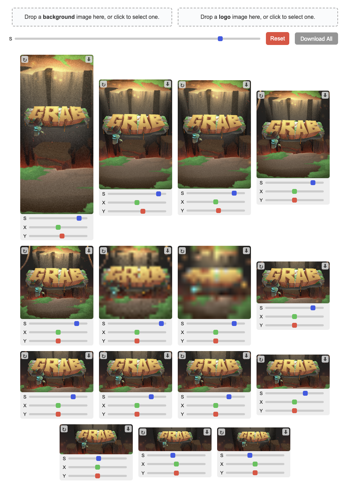

# Steam Media

Tool for bulk generating 'decent' Steam store graphical assets.

Current resolutions:

- Header Capsule (290 x 430)
- Small Capsule (426 x 174)
- Main Capsule (1232 x 706)
- Vertical Capsule (748 x 896)
- Page Background (1438 x 810)
- Community Icon (184 x 184)
- Client Icon (32 x 32)
- Client Image (16 x 16)
- Broadcast Side Panel (155 x 337)
- Library Capsule (600 x 900)
- Library Hero (3840 x 1240)
- Library Logo (1280 x 720)
- Library Header Capsule (920 x 430)
- Event Cover (800 x 450)
- Event Header (1920 x 622)